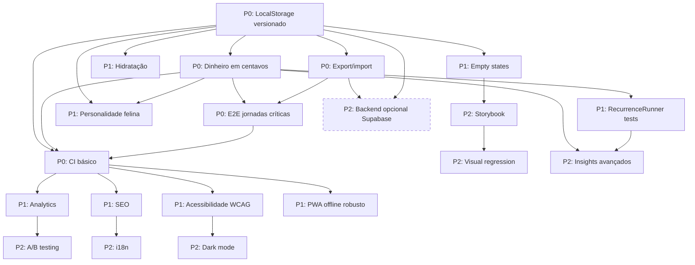

# Meowney — Plano de Implementação & Roadmap

> **Arquivo alvo:** `d:\Creative Developer Solo\projetos\pessoal\cases\meowney\ROADMAP.md`  
> **Regra absoluta:** o Meowney deve permanecer **sempre** como um **webapp client-side**: Next.js 15+ App Router, estado persistido em LocalStorage via Zustand persist, PWA instalável e funcional offline. Nenhuma feature pode exigir backend obrigatório. Backend é apenas uma **feature opcional de longo prazo**, opt-in, desacoplada e nunca bloqueante para o uso local.

---

## 1. Status atual e resumo da auditoria

### 1.1 Posição atual do produto

O Meowney é um webapp de finanças pessoais com personalidade felina kawaii, focado em uso rápido, local e privado. O produto já possui valor claro: controle de saldo, transações, cofrinho/metas e experiência afetiva. Porém, a auditoria identificou débitos que comprometem confiabilidade, acessibilidade, manutenção e crescimento.

### 1.2 Resumo executivo da auditoria

| Prioridade | Tema | Risco atual | Impacto | Diretriz |
|---|---|---|---|---|
| P0 | LocalStorage sem versionamento | Quebra de schema pode corromper dados | Perda de dados do usuário | Versionar chave, migração Zod, fallback seguro |
| P0 | Dinheiro com float | Erros de arredondamento | Saldo incorreto | Usar `amountCents` inteiro |
| P0 | Modal sem acessibilidade | Sem focus trap, ESC, ARIA | Usuários de teclado/leitor de tela bloqueados | Dialog acessível WCAG |
| P0 | Service Worker sem versão | Cache antigo serve build quebrado | PWA instável | Cache versionado e atualização estratégica |
| P0 | Sem export/import | Usuário fica preso ao dispositivo | Risco de perda total | Exportar/importar JSON/CSV validado |
| P0 | Sem CI | Regressões entram silenciosamente | Qualidade instável | GitHub Actions com typecheck, lint, testes e build |
| P0 | Sem E2E crítico | Jornadas principais sem proteção | Quebra de produto invisível | Playwright nas jornadas críticas |
| P1 | Sem analytics | Sem visão de conversão/ativação | Decisões às cegas | Eventos locais/privados de produto |
| P1 | SEO incompleto | Descoberta fraca | Menos crescimento orgânico | Metadata, OG image, sitemap, robots, JSON-LD |
| P1 | Hidratação inconsistente | UI pisca/erro entre SSR e client | Percepção de bug | Flag `hasHydrated` + skeletons |
| P1 | RecurrenceRunner pouco testado | Risco em datas e duplicações | Transações recorrentes erradas | Vitest para regras críticas |
| P1 | Personalidade estática | Gato não reage ao contexto | Produto menos vivo | Mensagens por estado financeiro |
| P1 | Empty states faltando | Telas vazias sem onboarding | Usuário não entende próximo passo | Empty states kawaii acionáveis |
| P1 | Acessibilidade incompleta | Fluxos não são universais | Exclusão de usuários | WCAG 2.2 AA |
| P1 | PWA offline frágil | Offline sem fallback claro | Falha em mobilidade | Offline fallback + cache por rota |
| P2 | Escala | Produto precisa amadurecer sem perder essência | Dificuldade de evolução | Dark mode, Storybook, VR testing, insights, i18n, A/B, sync opcional |

### 1.3 Princípios inegociáveis

1. **Local-first absoluto**  
   O usuário deve conseguir usar o Meowney 100% offline e sem conta.

2. **Dados locais são a fonte primária**  
   Qualquer backend futuro apenas sincroniza uma cópia opcional.

3. **Nenhuma feature pode depender de servidor para funcionar**  
   Login, sync, analytics externo ou API não podem bloquear saldo, transações, metas ou PWA.

4. **Privacidade por padrão**  
   Dados financeiros permanecem no dispositivo do usuário, exceto se ele optar explicitamente por sincronizar.

5. **Experiência kawaii com confiabilidade sênior**  
   A fofura não pode esconder bugs: dados monetários, acessibilidade e testes são obrigatórios.

---

## 2. Plano de implementação P0 — 0 a 7 dias

Objetivo: tornar o Meowney **confiável para uso real**, eliminando riscos de perda de dados, erros monetários, falhas de PWA e ausência de qualidade automatizada.

### 2.0 Visão geral da fase P0

| Item | Entrega | Prioridade | Estimativa | Arquivos principais |
|---|---|---:|---:|---|
| 1 | LocalStorage versionado com migração Zod | P0 | 1 dia | `src/store/schema.ts`, `src/store/migrations.ts`, `src/store/index.ts` |
| 2 | Dinheiro em centavos inteiros | P0 | 1 dia | `src/lib/money.ts`, `src/store/index.ts`, formulários |
| 3 | Modal de saldo acessível | P0 | 0.5 dia | `src/components/modals/balance-modal.tsx`, `src/hooks/use-focus-trap.ts` |
| 4 | Service Worker versionado | P0 | 1 dia | `public/sw.js`, `src/components/service-worker-registrar.tsx` |
| 5 | Export/import de dados | P0 | 1 dia | `src/lib/exporters.ts`, `src/lib/importers.ts`, settings |
| 6 | CI básico | P0 | 0.5 dia | `.github/workflows/ci.yml`, `package.json` |
| 7 | E2E das jornadas críticas | P0 | 1.5 dia | `e2e/*.spec.ts`, `playwright.config.ts` |

---

## 2.1 LocalStorage versionado, migração Zod e fallback seguro

### Objetivo

Evitar que qualquer mudança de schema quebre o app ou corrompa dados persistidos.

### Checklist

- [ ] Criar schema Zod para estado persistido.
- [ ] Definir chave de storage versionada: `meowney:v1`.
- [ ] Criar função de migração para schemas legados.
- [ ] Converter valores monetários legados para centavos.
- [ ] Em caso de dados inválidos, mover chave corrompida para backup e iniciar estado limpo.
- [ ] Garantir que o store exponha `hasHydrated`.
- [ ] Adicionar teste unitário para migração de estado legado.
- [ ] Adicionar teste para fallback quando storage estiver corrompido.

### Arquivos a criar/editar

- `src/store/schema.ts`
- `src/store/migrations.ts`
- `src/store/index.ts`
- `src/store/selectors.ts`
- `src/tests/store/migrations.test.ts`

### Código de referência

```ts
// src/store/schema.ts
import { z } from "zod";

export const CURRENT_SCHEMA_VERSION = 1;

export const TransactionSchema = z.object({
  id: z.string().uuid(),
  description: z.string().min(1),
  type: z.enum(["income", "expense", "transfer"]),
  amountCents: z.number().int(),
  categoryId: z.string().optional(),
  createdAt: z.string().datetime(),
  recurrenceId: z.string().optional(),
});

export const GoalSchema = z.object({
  id: z.string().uuid(),
  name: z.string().min(1),
  targetCents: z.number().int().nonnegative(),
  savedCents: z.number().int().nonnegative(),
  createdAt: z.string().datetime(),
});

export const SettingsSchema = z.object({
  theme: z.enum(["light", "dark", "system"]).optional(),
  locale: z.enum(["pt-BR", "en-US"]).optional(),
});

export const PersistedStateSchema = z.object({
  version: z.literal(CURRENT_SCHEMA_VERSION),
  transactions: z.array(TransactionSchema).default([]),
  goals: z.array(GoalSchema).default([]),
  settings: SettingsSchema.optional(),
});

export type Transaction = z.infer<typeof TransactionSchema>;
export type Goal = z.infer<typeof GoalSchema>;
export type PersistedState = z.infer<typeof PersistedStateSchema>;
```

```ts
// src/store/migrations.ts
import {
  CURRENT_SCHEMA_VERSION,
  PersistedState,
  PersistedStateSchema,
} from "./schema";

const LegacyTransactionSchema = z.object({
  id: z.string(),
  description: z.string(),
  amount: z.number().optional(),
  amountCents: z.number().int().optional(),
  type: z.enum(["income", "expense", "transfer"]),
  createdAt: z.string(),
});

const LegacyStateSchema = z.object({
  transactions: z.array(LegacyTransactionSchema).default([]),
  goals: z.array(z.unknown()).default([]),
  settings: z.unknown().optional(),
});

export function createInitialState(): PersistedState {
  return {
    version: CURRENT_SCHEMA_VERSION,
    transactions: [],
    goals: [],
    settings: {},
  };
}

function quarantineCorruptState(raw: unknown) {
  if (typeof window === "undefined") return;

  const backupKey = `meowney:corrupt:${Date.now()}`;
  try {
    window.localStorage.setItem(backupKey, JSON.stringify(raw));
  } catch {
    // Storage cheio ou indisponível: apenas seguir com estado limpo.
  }
}

export function migratePersistedState(raw: unknown): PersistedState {
  const current = PersistedStateSchema.safeParse(raw);
  if (current.success) return current.data;

  const legacy = LegacyStateSchema.safeParse(raw);

  if (legacy.success) {
    return {
      version: CURRENT_SCHEMA_VERSION,
      transactions: legacy.data.transactions.map((transaction) => ({
        id: transaction.id,
        description: transaction.description,
        type: transaction.type,
        createdAt: transaction.createdAt,
        amountCents:
          transaction.amountCents ??
          Math.round((transaction.amount ?? 0) * 100),
      })),
      goals: [],
      settings: {},
    };
  }

  quarantineCorruptState(raw);
  return createInitialState();
}
```

```ts
// src/store/index.ts
import { create } from "zustand";
import { persist, createJSONStorage } from "zustand/middleware";
import { migratePersistedState, createInitialState } from "./migrations";
import { CURRENT_SCHEMA_VERSION, PersistedState } from "./schema";

type MeowneyState = PersistedState & {
  hasHydrated: boolean;
  setHasHydrated: (value: boolean) => void;
};

export const useMeowneyStore = create<MeowneyState>()(
  persist(
    (set) => ({
      ...createInitialState(),
      hasHydrated: false,
      setHasHydrated: (value) => set({ hasHydrated: value }),
    }),
    {
      name: "meowney:v1",
      version: CURRENT_SCHEMA_VERSION,
      storage: createJSONStorage(() => localStorage),
      migrate: (persistedState) => migratePersistedState(persistedState),
      onRehydrateStorage: () => (state, error) => {
        if (error) {
          console.error("Falha ao reidratar storage do Meowney", error);
        }
        state?.setHasHydrated(true);
      },
    }
  )
);
```

### Critério de aceite

- [ ] O estado é salvo em `localStorage` na chave `meowney:v1`.
- [ ] Um estado legado com `amount: 10.5` vira `amountCents: 1050`.
- [ ] Um estado corrompido não quebra o app.
- [ ] Dados corrompidos são movidos para `meowney:corrupt:*`.
- [ ] O app abre com estado limpo após falha de parse.
- [ ] Testes unitários cobrem migração e fallback.
- [ ] Nenhum componente lê saldo antes de `hasHydrated`.

---

## 2.2 Dinheiro calculado em centavos inteiros

### Objetivo

Eliminar bugs de arredondamento causados por `float`. Todo cálculo monetário deve usar centavos como inteiro.

### Checklist

- [ ] Criar utilitários de dinheiro em `src/lib/money.ts`.
- [ ] Substituir `amount` por `amountCents` em transações.
- [ ] Substituir metas por `targetCents` e `savedCents`.
- [ ] Atualizar saldo para `balanceCents`.
- [ ] Atualizar formulários para converter input humano em centavos.
- [ ] Proibir `parseFloat` para valores monetários.
- [ ] Atualizar testes unitários de soma, subtração e formatação.
- [ ] Migrar dados legados na camada de persistência.

### Arquivos a criar/editar

- `src/lib/money.ts`
- `src/store/index.ts`
- `src/store/selectors.ts`
- `src/components/forms/transaction-form.tsx`
- `src/components/forms/goal-form.tsx`
- `src/app/app/page.tsx`
- `src/tests/lib/money.test.ts`

### Código de referência

```ts
// src/lib/money.ts
export function formatBRL(cents: number): string {
  return new Intl.NumberFormat("pt-BR", {
    style: "currency",
    currency: "BRL",
  }).format(cents / 100);
}

export function parseBRLInputToCents(input: string): number {
  const normalized = input
    .replace(/R\$/gi, "")
    .replace(/\s/g, "")
    .replace(/\./g, "")
    .replace(",", ".");

  const value = Number(normalized);

  if (!Number.isFinite(value)) {
    return 0;
  }

  return Math.round(value * 100);
}

export function sumCents(values: number[]): number {
  return values.reduce((total, value) => total + value, 0);
}

export function calculateBalanceCents(
  transactions: Array<{ type: "income" | "expense" | "transfer"; amountCents: number }>
): number {
  return transactions.reduce((balance, transaction) => {
    if (transaction.type === "income") {
      return balance + transaction.amountCents;
    }

    if (transaction.type === "expense") {
      return balance - transaction.amountCents;
    }

    return balance;
  }, 0);
}
```

### Regra de implementação

```ts
// Errado
const total = transactions.reduce((acc, t) => acc + t.amount, 0);

// Certo
const totalCents = transactions.reduce((acc, t) => acc + t.amountCents, 0);
```

### Critério de aceite

- [ ] Nenhuma transação possui campo monetário float como fonte de verdade.
- [ ] Todo valor monetário persistido é inteiro em centavos.
- [ ] `0.1 + 0.2` não produz erro visível no saldo.
- [ ] Formatação BRL usa `formatBRL(cents)`.
- [ ] Formulários convertem input para centavos antes de salvar.
- [ ] Testes cobrem formatação, parsing e cálculo de saldo.

---

## 2.3 Modal de saldo com focus trap, ESC e ARIA

### Objetivo

Tornar o modal de saldo utilizável por teclado e leitores de tela.

### Checklist

- [ ] Usar `role="dialog"` e `aria-modal="true"`.
- [ ] Definir `aria-labelledby` e `aria-describedby`.
- [ ] Implementar focus trap.
- [ ] Fechar com ESC.
- [ ] Fechar ao clicar fora apenas se não houver risco de perda de dados.
- [ ] Devolver foco ao elemento que abriu o modal.
- [ ] Garantir botão de fechar visível e acessível.
- [ ] Testar com teclado: Tab, Shift+Tab, Enter, ESC.

### Arquivos a criar/editar

- `src/hooks/use-focus-trap.ts`
- `src/components/modals/balance-modal.tsx`
- `src/components/ui/dialog.tsx`
- `src/app/app/page.tsx`

### Código de referência

```tsx
// src/hooks/use-focus-trap.ts
"use client";

import { RefObject, useEffect } from "react";

const FOCUSABLE_SELECTOR = [
  "a[href]",
  "button:not([disabled])",
  "input:not([disabled])",
  "select:not([disabled])",
  "textarea:not([disabled])",
  '[tabindex]:not([tabindex="-1"])',
].join(",");

export function useFocusTrap(
  ref: RefObject<HTMLElement | null>,
  active: boolean,
  onClose: () => void
) {
  useEffect(() => {
    if (!active || !ref.current) return;

    const container = ref.current;
    const previouslyFocused = document.activeElement as HTMLElement | null;

    const focusables = () =>
      Array.from(container.querySelectorAll<HTMLElement>(FOCUSABLE_SELECTOR));

    const first = focusables()[0];
    first?.focus();

    function handleKeyDown(event: KeyboardEvent) {
      if (event.key === "Escape") {
        event.preventDefault();
        onClose();
        return;
      }

      if (event.key !== "Tab") return;

      const elements = focusables();
      if (elements.length === 0) return;

      const firstElement = elements[0];
      const lastElement = elements[elements.length - 1];

      if (event.shiftKey && document.activeElement === firstElement) {
        event.preventDefault();
        lastElement.focus();
      }

      if (!event.shiftKey && document.activeElement === lastElement) {
        event.preventDefault();
        firstElement.focus();
      }
    }

    document.addEventListener("keydown", handleKeyDown);

    return () => {
      document.removeEventListener("keydown", handleKeyDown);
      previouslyFocused?.focus();
    };
  }, [active, onClose, ref]);
}
```

```tsx
// src/components/modals/balance-modal.tsx
"use client";

import { useRef } from "react";
import { useFocusTrap } from "@/hooks/use-focus-trap";

type BalanceModalProps = {
  open: boolean;
  onClose: () => void;
};

export function BalanceModal({ open, onClose }: BalanceModalProps) {
  const dialogRef = useRef<HTMLDivElement>(null);
  useFocusTrap(dialogRef, open, onClose);

  if (!open) return null;

  return (
    <div className="fixed inset-0 z-50 grid place-items-center bg-black/40 p-4">
      <div
        ref={dialogRef}
        role="dialog"
        aria-modal="true"
        aria-labelledby="balance-modal-title"
        aria-describedby="balance-modal-description"
        className="w-full max-w-md rounded-3xl bg-white p-6 shadow-xl"
      >
        <h2 id="balance-modal-title">Seu saldo</h2>
        <p id="balance-modal-description">
          Aqui está o resumo do seu dinheiro neste momento.
        </p>

        <button type="button" onClick={onClose} aria-label="Fechar modal de saldo">
          Fechar
        </button>
      </div>
    </div>
  );
}
```

### Critério de aceite

- [ ] Modal abre com foco no primeiro elemento focável.
- [ ] Tab e Shift+Tab permanecem dentro do modal.
- [ ] ESC fecha o modal.
- [ ] Ao fechar, o foco volta para o elemento de origem.
- [ ] Leitor de tela anuncia dialog com título e descrição.
- [ ] Nenhum clique fora prende foco ou perde contexto silenciosamente.

---

## 2.4 Service Worker com cache versionado e skipWaiting estratégico

### Objetivo

Evitar que o PWA sirva uma versão quebrada ou antiga. O SW deve versionar cache, limpar caches antigos e permitir atualização controlada.

### Checklist

- [ ] Criar constante `CACHE_VERSION`.
- [ ] Precache de shell básico: `/`, `/app`, `/offline`, manifest.
- [ ] Limpar caches antigos no `activate`.
- [ ] Estratégia de navegação: network-first com fallback offline.
- [ ] Estratégia para assets: stale-while-revalidate ou cache-first seguro.
- [ ] Não cachear respostas opacas não confiáveis como críticas.
- [ ] Implementar `SKIP_WAITING` via mensagem do app.
- [ ] Criar UI opcional para avisar “Nova versão disponível”.
- [ ] Registrar SW apenas em produção.

### Arquivos a criar/editar

- `public/sw.js`
- `public/offline.html` ou `src/app/offline/page.tsx`
- `src/components/service-worker-registrar.tsx`
- `src/app/layout.tsx`

### Código de referência

```js
// public/sw.js
const CACHE_VERSION = "meowney-cache-v1";
const APP_SHELL = [
  "/",
  "/app",
  "/offline",
  "/manifest.webmanifest",
];

self.addEventListener("install", (event) => {
  event.waitUntil(
    caches.open(CACHE_VERSION).then((cache) => cache.addAll(APP_SHELL))
  );
});

self.addEventListener("activate", (event) => {
  event.waitUntil(
    caches
      .keys()
      .then((keys) =>
        Promise.all(
          keys
            .filter((key) => key !== CACHE_VERSION)
            .map((key) => caches.delete(key))
        )
      )
      .then(() => self.clients.claim())
  );
});

self.addEventListener("message", (event) => {
  if (event.data === "SKIP_WAITING") {
    self.skipWaiting();
  }
});

self.addEventListener("fetch", (event) => {
  const { request } = event;

  if (request.mode === "navigate") {
    event.respondWith(
      fetch(request)
        .then((response) => {
          const copy = response.clone();
          caches.open(CACHE_VERSION).then((cache) => cache.put(request, copy));
          return response;
        })
        .catch(() => caches.match(request).then((cached) => cached || caches.match("/offline")))
    );
    return;
  }

  if (request.destination === "style" || request.destination === "script") {
    event.respondWith(
      caches.match(request).then((cached) => {
        const fetchPromise = fetch(request)
          .then((response) => {
            const copy = response.clone();
            caches.open(CACHE_VERSION).then((cache) => cache.put(request, copy));
            return response;
          })
          .catch(() => cached);

        return cached || fetchPromise;
      })
    );
    return;
  }

  event.respondWith(
    caches.match(request).then((cached) => cached || fetch(request))
  );
});
```

```tsx
// src/components/service-worker-registrar.tsx
"use client";

import { useEffect } from "react";

export function ServiceWorkerRegistrar() {
  useEffect(() => {
    if (process.env.NODE_ENV !== "production") return;
    if (!("serviceWorker" in navigator)) return;

    window.addEventListener("load", () => {
      navigator.serviceWorker.register("/sw.js").catch((error) => {
        console.error("Falha ao registrar Service Worker", error);
      });
    });
  }, []);

  return null;
}
```

### Estratégia de skipWaiting

- O novo SW instala, mas não ativa automaticamente se o usuário estiver usando o app.
- O app detecta `updatefound` e mostra banner: “Nova versão disponível”.
- Ao clicar em “Atualizar”, o app envia `SKIP_WAITING`.
- Após ativação, recarregar apenas em momento seguro ou com confirmação.

### Critério de aceite

- [ ] `CACHE_VERSION` é alterado a cada release relevante.
- [ ] Caches antigos são removidos no activate.
- [ ] Offline abre `/offline` em navegação sem rede.
- [ ] Build novo não fica preso indefinidamente.
- [ ] Usuário não é interrompido por reload automático no meio de uma ação.
- [ ] Lighthouse PWA não apresenta falha crítica de Service Worker.

---

## 2.5 Export/import de dados

### Objetivo

Permitir backup, portabilidade e recuperação de dados sem backend.

### Checklist

- [ ] Exportar JSON completo com schema versionado.
- [ ] Exportar CSV de transações.
- [ ] Importar JSON com validação Zod.
- [ ] Antes de importar, criar backup do estado atual.
- [ ] Mostrar confirmação antes de substituir dados.
- [ ] Tratar erro de importação com mensagem amigável.
- [ ] Não importar arquivo sem `schemaVersion` ou `state`.
- [ ] Testar import de arquivo válido, inválido e legado.

### Arquivos a criar/editar

- `src/lib/exporters.ts`
- `src/lib/importers.ts`
- `src/components/settings/data-portability.tsx`
- `src/app/app/settings/page.tsx` ou modal de configurações

### Código de referência

```ts
// src/lib/exporters.ts
import { PersistedState } from "@/store/schema";

export function exportStateAsJSON(state: PersistedState) {
  const payload = {
    app: "meowney",
    schemaVersion: 1,
    exportedAt: new Date().toISOString(),
    state,
  };

  const blob = new Blob([JSON.stringify(payload, null, 2)], {
    type: "application/json",
  });

  const url = URL.createObjectURL(blob);
  const anchor = document.createElement("a");
  anchor.href = url;
  anchor.download = `meowney-backup-${new Date().toISOString().slice(0, 10)}.json`;
  anchor.click();
  URL.revokeObjectURL(url);
}

export function exportTransactionsAsCSV(
  transactions: Array<{
    createdAt: string;
    description: string;
    type: string;
    amountCents: number;
  }>
) {
  const header = "createdAt,description,type,amountCents";
  const rows = transactions.map((transaction) => {
    const description = `"${transaction.description.replaceAll('"', '""')}"`;
    return [transaction.createdAt, description, transaction.type, transaction.amountCents].join(",");
  });

  const blob = new Blob([[header, ...rows].join("\n")], {
    type: "text/csv;charset=utf-8",
  });

  const url = URL.createObjectURL(blob);
  const anchor = document.createElement("a");
  anchor.href = url;
  anchor.download = "meowney-transactions.csv";
  anchor.click();
  URL.revokeObjectURL(url);
}
```

```ts
// src/lib/importers.ts
import { z } from "zod";
import { migratePersistedState } from "@/store/migrations";
import { PersistedState } from "@/store/schema";

const ImportFileSchema = z.object({
  app: z.literal("meowney").optional(),
  schemaVersion: z.number().optional(),
  exportedAt: z.string().optional(),
  state: z.unknown(),
});

export async function importStateFromJSONFile(file: File): Promise<PersistedState> {
  const text = await file.text();

  let raw: unknown;
  try {
    raw = JSON.parse(text);
  } catch {
    throw new Error("O arquivo não é um JSON válido.");
  }

  const parsed = ImportFileSchema.safeParse(raw);

  if (!parsed.success) {
    throw new Error("O arquivo não possui o formato esperado do Meowney.");
  }

  return migratePersistedState(parsed.data.state);
}
```

### Critério de aceite

- [ ] Usuário exporta backup JSON com um clique.
- [ ] Usuário exporta CSV de transações.
- [ ] Importação válida substitui estado com confirmação.
- [ ] Importação inválida mostra erro e não corrompe estado atual.
- [ ] Backup automático local é criado antes da importação.
- [ ] Export/import funcionam 100% offline.

---

## 2.6 CI básico com GitHub Actions

### Objetivo

Impedir que regressões cheguem à branch principal.

### Checklist

- [ ] Adicionar scripts: `typecheck`, `lint`, `test`, `build`, `test:e2e`.
- [ ] CI roda em push e pull request.
- [ ] Instalar dependências com cache.
- [ ] Rodar typecheck.
- [ ] Rodar lint.
- [ ] Rodar testes unitários com Vitest.
- [ ] Rodar build Next.js.
- [ ] Rodar Playwright após build.
- [ ] Publicar artefatos de falha E2E quando possível.

### Arquivos a criar/editar

- `.github/workflows/ci.yml`
- `package.json`
- `vitest.config.ts`
- `playwright.config.ts`

### Código de referência

```yaml
# .github/workflows/ci.yml
name: CI

on:
  push:
    branches: [main]
  pull_request:

jobs:
  quality:
    runs-on: ubuntu-latest

    steps:
      - name: Checkout
        uses: actions/checkout@v4

      - name: Setup Node
        uses: actions/setup-node@v4
        with:
          node-version: 20
          cache: npm

      - name: Install dependencies
        run: npm ci

      - name: Typecheck
        run: npm run typecheck

      - name: Lint
        run: npm run lint

      - name: Unit tests
        run: npm run test -- --run

      - name: Build
        run: npm run build

      - name: Install Playwright browsers
        run: npx playwright install --with-deps chromium

      - name: E2E tests
        run: npm run test:e2e

      - name: Upload Playwright report
        if: failure()
        uses: actions/upload-artifact@v4
        with:
          name: playwright-report
          path: playwright-report/
          retention-days: 7
```

### Scripts recomendados

```json
{
  "scripts": {
    "dev": "next dev",
    "build": "next build",
    "start": "next start",
    "typecheck": "tsc --noEmit",
    "lint": "next lint",
    "test": "vitest",
    "test:e2e": "playwright test"
  }
}
```

### Critério de aceite

- [ ] CI falha se typecheck falhar.
- [ ] CI falha se lint falhar.
- [ ] CI falha se testes unitários falharem.
- [ ] CI falha se build falhar.
- [ ] CI falha se E2E crítico falhar.
- [ ] PR não pode ser mergeado sem CI verde.

---

## 2.7 E2E das jornadas críticas com Playwright

### Objetivo

Proteger as jornadas principais do produto contra regressões.

### Jornadas mínimas

1. Landing → CTA → abre app.
2. Usuário cria primeira transação.
3. Saldo atualiza corretamente.
4. Usuário cria cofrinho/meta.
5. Usuário adiciona valor ao cofrinho.
6. Dados persistem após reload.
7. Offline fallback não quebra a navegação.

### Arquivos a criar/editar

- `playwright.config.ts`
- `e2e/landing.spec.ts`
- `e2e/transactions.spec.ts`
- `e2e/goals.spec.ts`
- `e2e/persistence.spec.ts`

### Código de referência

```ts
// e2e/critical-journeys.spec.ts
import { expect, test } from "@playwright/test";

test("landing CTA leva ao app", async ({ page }) => {
  await page.goto("/");
  await page.getByRole("link", { name: /começar|usar agora|abrir app/i }).click();
  await expect(page).toHaveURL(/\/app/);
});

test("primeira transação atualiza saldo e persiste após reload", async ({ page }) => {
  await page.goto("/app");

  await page.getByRole("button", { name: /nova transação/i }).click();
  await page.getByLabel(/descrição/i).fill("Ração do gato");
  await page.getByLabel(/valor/i).fill("25,90");
  await page.getByRole("button", { name: /salvar/i }).click();

  await expect(page.getByText(/R\$\s*25,90/)).toBeVisible();

  await page.reload();

  await expect(page.getByText(/Ração do gato/)).toBeVisible();
  await expect(page.getByText(/R\$\s*25,90/)).toBeVisible();
});

test("cofrinho recebe aporte e persiste", async ({ page }) => {
  await page.goto("/app");

  await page.getByRole("button", { name: /novo cofrinho|nova meta/i }).click();
  await page.getByLabel(/nome/i).fill("Viagem");
  await page.getByLabel(/meta/i).fill("1000,00");
  await page.getByRole("button", { name: /criar/i }).click();

  await page.getByRole("button", { name: /adicionar valor/i }).click();
  await page.getByLabel(/valor/i).fill("100,00");
  await page.getByRole("button", { name: /salvar/i }).click();

  await expect(page.getByText(/R\$\s*100,00/)).toBeVisible();

  await page.reload();

  await expect(page.getByText(/Viagem/)).toBeVisible();
  await expect(page.getByText(/R\$\s*100,00/)).toBeVisible();
});
```

### Critério de aceite

- [ ] CTA da landing leva ao app.
- [ ] Criar transação atualiza saldo.
- [ ] Saldo persiste após reload.
- [ ] Criar cofrinho funciona.
- [ ] Aporte no cofrinho persiste.
- [ ] Testes rodam no CI.
- [ ] Falha E2E bloqueia merge.

---

# 3. Plano de implementação P1 — 7 a 30 dias

Objetivo: transformar o Meowney em um produto **confiável, observável, acessível, encantador e preparado para crescimento orgânico**, ainda 100% client-side.

## 3.0 Visão geral da fase P1

| Item | Entrega | Prioridade | Estimativa | Arquivos principais |
|---|---|---:|---:|---|
| 8 | Analytics de conversão | P1 | 2 dias | `src/lib/analytics.ts`, landing, app |
| 9 | SEO completo | P1 | 2 dias | `src/app/layout.tsx`, `sitemap.ts`, `robots.ts`, OG image |
| 10 | Hidratação consistente | P1 | 1 dia | `src/store/index.ts`, skeletons |
| 11 | Testes do RecurrenceRunner | P1 | 2 dias | `src/lib/recurrence-runner.ts`, testes |
| 12 | Personalidade felina dinâmica | P1 | 2 dias | `src/lib/cat-messages.ts`, dashboard |
| 13 | Empty states kawaii | P1 | 2 dias | `src/components/empty-states/*` |
| 14 | Acessibilidade WCAG 2.2 AA | P1 | 4 dias | componentes globais |
| 15 | PWA offline robusto | P1 | 2 dias | `public/sw.js`, `/offline` |

---

## 3.1 Analytics de conversão sem backend obrigatório

### Objetivo

Medir ativação, conversão e retenção sem violar a arquitetura local-first.

### Princípios

- Nenhum dado financeiro sensível deve ser enviado para fora.
- Nenhum evento pode bloquear a UI.
- Analytics deve ser opcional e abstraído.
- Eventos podem ser enviados para provider externo configurável, mas o app funciona sem ele.
- Não coletar CPF, nome, e-mail, conta bancária ou descrição completa de transação.

### Eventos recomendados

| Evento | Momento | Propriedades seguras |
|---|---|---|
| `landing_view` | Abre landing | `path`, `referrer_domain` |
| `cta_clicked` | CTA principal | `cta_id`, `cta_location` |
| `app_opened` | Abre `/app` | `has_data` boolean |
| `first_transaction_created` | Primeira transação | `type`, `has_goals` |
| `transaction_created` | Transação criada | `type`, `has_category` |
| `goal_created` | Meta criada | `has_target` boolean |
| `goal_deposit_created` | Aporte em meta | `percent_of_goal_bucket` |
| `export_completed` | Backup exportado | `format` |
| `import_completed` | Backup importado | `success` |
| `retention_daily_open` | Primeiro open do dia | `days_since_first_use` bucket |
| `scroll_depth` | 25/50/75/100% na landing | `depth` |

### Checklist

- [ ] Criar `src/lib/analytics.ts`.
- [ ] Criar fila local para eventos offline.
- [ ] Criar provider noop padrão.
- [ ] Permitir provider opcional via env.
- [ ] Marcar `first_transaction_created` apenas uma vez.
- [ ] Medir CTA da landing.
- [ ] Medir scroll depth na landing.
- [ ] Medir retenção diária com flag local.
- [ ] Não enviar texto livre de descrição.
- [ ] Criar teste para eventos críticos.

### Arquivos a criar/editar

- `src/lib/analytics.ts`
- `src/app/(marketing)/page.tsx`
- `src/app/app/page.tsx`
- `src/components/forms/transaction-form.tsx`
- `src/components/forms/goal-form.tsx`

### Código de referência

```ts
// src/lib/analytics.ts
type AnalyticsEvent =
  | "landing_view"
  | "cta_clicked"
  | "app_opened"
  | "first_transaction_created"
  | "transaction_created"
  | "goal_created"
  | "goal_deposit_created"
  | "export_completed"
  | "import_completed"
  | "retention_daily_open"
  | "scroll_depth";

type AnalyticsPayload = Record<string, string | number | boolean>;

const QUEUE_KEY = "meowney:analytics-queue";

function readQueue(): unknown[] {
  try {
    return JSON.parse(localStorage.getItem(QUEUE_KEY) ?? "[]");
  } catch {
    return [];
  }
}

function writeQueue(queue: unknown[]) {
  localStorage.setItem(QUEUE_KEY, JSON.stringify(queue));
}

export function track(event: AnalyticsEvent, payload: AnalyticsPayload = {}) {
  if (typeof window === "undefined") return;

  const entry = {
    event,
    ts: new Date().toISOString(),
    payload,
  };

  const queue = readQueue();
  queue.push(entry);
  writeQueue(queue);

  // Provider externo opcional pode consumir a fila ou o evento.
  window.dispatchEvent(new CustomEvent("meowney:analytics", { detail: entry }));
}
```

### Critério de aceite

- [ ] Eventos disparam sem bloquear UI.
- [ ] App funciona normalmente sem analytics configurado.
- [ ] Nenhum dado sensível é enviado.
- [ ] Primeira transação dispara evento uma única vez.
- [ ] Eventos offline ficam em fila local.
- [ ] Testes validam eventos de CTA e ativação.

---

## 3.2 SEO completo com Next.js Metadata API

### Objetivo

Melhorar descoberta, compartilhamento e apresentação em buscadores/redes sociais.

### Checklist

- [ ] Definir `metadataBase`.
- [ ] Configurar title template.
- [ ] Configurar description, OpenGraph e Twitter card.
- [ ] Criar `sitemap.ts`.
- [ ] Criar `robots.ts`.
- [ ] Criar OG image dinâmica.
- [ ] Adicionar JSON-LD `FinancialProduct` na landing.
- [ ] Dar `noindex` para áreas privadas/app se necessário.
- [ ] Validar com Google Rich Results e OpenGraph debugger.

### Arquivos a criar/editar

- `src/app/layout.tsx`
- `src/app/(marketing)/page.tsx`
- `src/app/sitemap.ts`
- `src/app/robots.ts`
- `src/app/opengraph-image.tsx`
- `src/components/json-ld.tsx`

### Código de referência

```ts
// src/app/layout.tsx
import type { Metadata } from "next";

export const metadata: Metadata = {
  metadataBase: new URL("https://meowney.app"),
  title: {
    default: "Meowney — Finanças pessoais com um gato kawaii",
    template: "%s | Meowney",
  },
  description:
    "Controle seu dinheiro de forma simples, local e fofa. O Meowney é um webapp de finanças pessoais que funciona direto no navegador.",
  openGraph: {
    title: "Meowney — Finanças pessoais com um gato kawaii",
    description:
      "Controle seu dinheiro de forma simples, local e fofa. Sem servidor obrigatório, com PWA e offline.",
    url: "https://meowney.app",
    siteName: "Meowney",
    locale: "pt_BR",
    type: "website",
  },
  robots: {
    index: true,
    follow: true,
  },
};
```

```ts
// src/app/sitemap.ts
import type { MetadataRoute } from "next";

export default function sitemap(): MetadataRoute.Sitemap {
  return [
    {
      url: "https://meowney.app",
      lastModified: new Date(),
      changeFrequency: "monthly",
      priority: 1,
    },
  ];
}
```

```ts
// src/app/robots.ts
import type { MetadataRoute } from "next";

export default function robots(): MetadataRoute.Robots {
  return {
    rules: [
      {
        userAgent: "*",
        allow: "/",
        disallow: ["/app", "/settings"],
      },
    ],
    sitemap: "https://meowney.app/sitemap.xml",
  };
}
```

```tsx
// src/components/json-ld.tsx
export function FinancialProductJsonLd() {
  const jsonLd = {
    "@context": "https://schema.org",
    "@type": "FinancialProduct",
    name: "Meowney",
    description:
      "Webapp client-side de finanças pessoais com experiência kawaii, funcionamento local e PWA.",
    brand: {
      "@type": "Brand",
      name: "Meowney",
    },
    url: "https://meowney.app",
    applicationCategory: "FinanceApplication",
    operatingSystem: "Web",
  };

  return (
    <script
      type="application/ld+json"
      dangerouslySetInnerHTML={{ __html: JSON.stringify(jsonLd) }}
    />
  );
}
```

### Critério de aceite

- [ ] Landing possui metadata completo.
- [ ] OG image é gerada dinamicamente.
- [ ] `sitemap.xml` é servido.
- [ ] `robots.txt` protege `/app`.
- [ ] JSON-LD é válido.
- [ ] Preview social mostra título, descrição e imagem corretos.

---

## 3.3 Hidratação consistente com skeletons

### Objetivo

Evitar mismatch entre SSR/SSG e client, além de prevenir UI piscando com estado errado.

### Checklist

- [ ] Store expõe `hasHydrated`.
- [ ] Componentes sensíveis ao estado local só renderizam dados após hidratação.
- [ ] Criar skeletons para saldo, lista de transações e cofrinhos.
- [ ] Não usar `localStorage` diretamente durante render inicial.
- [ ] Evitar `Math.random()` ou `Date.now()` sem controle na renderização inicial.
- [ ] Testar visualmente loading state.

### Arquivos a criar/editar

- `src/store/index.ts`
- `src/hooks/use-has-hydrated.ts`
- `src/components/skeletons/balance-skeleton.tsx`
- `src/components/skeletons/transaction-list-skeleton.tsx`
- `src/app/app/page.tsx`

### Código de referência

```ts
// src/hooks/use-has-hydrated.ts
"use client";

import { useEffect } from "react";
import { useMeowneyStore } from "@/store";

export function useHasHydrated() {
  const hasHydrated = useMeowneyStore((state) => state.hasHydrated);
  const setHasHydrated = useMeowneyStore((state) => state.setHasHydrated);

  useEffect(() => {
    // Fallback caso onRehydrateStorage não dispare em algum cenário.
    setHasHydrated(true);
  }, [setHasHydrated]);

  return hasHydrated;
}
```

```tsx
// src/app/app/page.tsx
"use client";

import { useHasHydrated } from "@/hooks/use-has-hydrated";
import { BalanceSkeleton } from "@/components/skeletons/balance-skeleton";

export default function AppPage() {
  const hasHydrated = useHasHydrated();

  if (!hasHydrated) {
    return <BalanceSkeleton />;
  }

  return <main>{/* dashboard real */}</main>;
}
```

### Critério de aceite

- [ ] Nenhum saldo incorreto aparece antes da hidratação.
- [ ] Skeleton é exibido enquanto o store hidrata.
- [ ] Não há warning de hydration mismatch nos testes/build.
- [ ] Reload não mostra flash de estado vazio incorreto.

---

## 3.4 Testes suficientes para RecurrenceRunner

### Objetivo

Garantir que transações recorrentes sejam criadas corretamente, sem duplicação e com datas consistentes.

### Checklist

- [ ] Isolar lógica de recorrência em função pura.
- [ ] Usar datas ISO/UTC como base.
- [ ] Testar recorrência diária, semanal, mensal e anual.
- [ ] Testar data final.
- [ ] Testar limite de instâncias.
- [ ] Testar deduplicação por `recurrenceId + occurrenceAt`.
- [ ] Testar meses com 28/29/30/31 dias.
- [ ] Testar timezone.
- [ ] Não permitir criação duplicada ao reabrir app.

### Arquivos a criar/editar

- `src/lib/recurrence-runner.ts`
- `src/tests/lib/recurrence-runner.test.ts`
- `src/store/index.ts`

### Código de referência

```ts
// src/tests/lib/recurrence-runner.test.ts
import { describe, expect, it } from "vitest";
import { runRecurrence } from "@/lib/recurrence-runner";

describe("runRecurrence", () => {
  it("cria instâncias mensais até o limite", () => {
    const result = runRecurrence({
      recurrenceId: "rec-1",
      startDate: "2026-01-31T12:00:00.000Z",
      frequency: "monthly",
      occurrences: 3,
      existingOccurrences: [],
    });

    expect(result).toHaveLength(3);
    expect(result[0].occurrenceAt).toContain("2026-01-31");
  });

  it("não duplica instâncias já criadas", () => {
    const result = runRecurrence({
      recurrenceId: "rec-1",
      startDate: "2026-01-01T12:00:00.000Z",
      frequency: "monthly",
      occurrences: 2,
      existingOccurrences: [
        {
          recurrenceId: "rec-1",
          occurrenceAt: "2026-01-01T12:00:00.000Z",
        },
      ],
    });

    expect(result).toHaveLength(1);
  });
});
```

### Critério de aceite

- [ ] Cobertura de recorrência mensal, semanal, diária e anual.
- [ ] Casos de fim de mês tratados.
- [ ] Duplicação bloqueada por chave composta.
- [ ] Testes passam em CI.
- [ ] Nenhuma recorrência cria transação com float.

---

## 3.5 Personalidade felina com conteúdo dinâmico

### Objetivo

Fazer o gato reagir ao estado financeiro do usuário, aumentando vínculo e clareza.

### Estados recomendados

| Estado financeiro | Mensagem do gato | Intenção |
|---|---|---|
| Saldo negativo | “Miau... precisamos cuidar disso juntos.” | Apoio, alerta suave |
| Saldo positivo saudável | “Ronron! Seu saldo está confortável.” | Reforço positivo |
| Meta atingida | “Você conseguiu! Eu sabia que dava.” | Celebração |
| Gasto acima da média | “Muitos petiscos hoje, humano?” | Alerta leve |
| Sem transações | “Vamos registrar a primeira moedinha?” | Onboarding |
| Cofrinho vazio | “Um potinho vazio ainda pode ficar cheio.” | Estímulo |
| Backup realizado | “Seus dados estão seguros no potinho.” | Confirmação |

### Checklist

- [ ] Criar `src/lib/cat-messages.ts`.
- [ ] Criar selector de estado financeiro.
- [ ] Definir regras por prioridade.
- [ ] Evitar mensagens repetitivas excessivas.
- [ ] Permitir dismiss temporário.
- [ ] Usar `role="status"` para mensagens não intrusivas.
- [ ] Testar mensagens críticas.

### Código de referência

```ts
// src/lib/cat-messages.ts
export type CatMessageId =
  | "negative-balance"
  | "healthy-balance"
  | "goal-completed"
  | "high-spending"
  | "no-transactions"
  | "empty-goal";

export type FinancialSnapshot = {
  balanceCents: number;
  hasTransactions: boolean;
  hasCompletedGoal: boolean;
  spendingAboveAverage: boolean;
};

export function getCatMessage(snapshot: FinancialSnapshot): {
  id: CatMessageId;
  text: string;
} {
  if (!snapshot.hasTransactions) {
    return {
      id: "no-transactions",
      text: "Vamos registrar sua primeira moedinha? Miau!",
    };
  }

  if (snapshot.hasCompletedGoal) {
    return {
      id: "goal-completed",
      text: "Ronron! Você atingiu uma meta. Orgulho felino.",
    };
  }

  if (snapshot.balanceCents < 0) {
    return {
      id: "negative-balance",
      text: "Miau... o saldo está negativo. Vamos olhar isso com carinho.",
    };
  }

  if (snapshot.spendingAboveAverage) {
    return {
      id: "high-spending",
      text: "Muitos gastos ultimamente. Talvez menos petiscos por enquanto?",
    };
  }

  return {
    id: "healthy-balance",
    text: "Seu saldo está confortável. Ronron aprovado.",
  };
}
```

### Critério de aceite

- [ ] Dashboard mostra mensagem contextual.
- [ ] Mensagens não bloqueiam tarefas.
- [ ] Texto é acessível via `role="status"` ou equivalente.
- [ ] Regras têm prioridade clara.
- [ ] Mensagens não expõem dados sensíveis.

---

## 3.6 Empty states kawaii e acionáveis

### Objetivo

Transformar telas vazias em onboarding guiado.

### Empty states obrigatórios

| Tela | Estado | CTA |
|---|---|---|
| Dashboard | Sem transações | “Criar primeira transação” |
| Lista de transações | Filtro sem resultados | “Limpar filtros” |
| Cofrinhos | Nenhuma meta | “Criar meu primeiro cofrinho” |
| Meta | Sem progresso | “Adicionar primeiro valor” |
| Insights | Dados insuficientes | “Registrar mais transações” |

### Checklist

- [ ] Criar componente genérico `EmptyState`.
- [ ] Usar ilustração kawaii com `alt` descritivo.
- [ ] Incluir título, descrição e CTA.
- [ ] Garantir foco no CTA após ação bem-sucedida.
- [ ] Não mostrar lista vazia sem explicação.
- [ ] Testar estados vazios no E2E.

### Código de referência

```tsx
// src/components/empty-states/empty-state.tsx
type EmptyStateProps = {
  title: string;
  description: string;
  actionLabel?: string;
  onAction?: () => void;
  illustrationAlt: string;
};

export function EmptyState({
  title,
  description,
  actionLabel,
  onAction,
  illustrationAlt,
}: EmptyStateProps) {
  return (
    <section role="status" className="rounded-3xl border p-8 text-center">
      
      <h2 className="mt-4 text-lg font-semibold">{title}</h2>
      <p className="mt-2 text-sm text-muted">{description}</p>

      {actionLabel && onAction ? (
        <button type="button" onClick={onAction} className="mt-4 btn-primary">
          {actionLabel}
        </button>
      ) : null}
    </section>
  );
}
```

### Critério de aceite

- [ ] Todo estado vazio tem CTA claro.
- [ ] Empty states são testáveis por E2E.
- [ ] Ilustrações têm texto alternativo.
- [ ] Usuário nunca fica sem próximo passo.

---

## 3.7 Acessibilidade WCAG 2.2 AA

### Objetivo

Tornar o Meowney utilizável por pessoas com teclado, leitor de tela, baixa visão, mobilidade reduzida e necessidades cognitivas.

### Checklist

- [ ] Contraste mínimo 4.5:1 para texto normal.
- [ ] Contraste mínimo 3:1 para textos grandes e componentes gráficos essenciais.
- [ ] Todos os campos têm label associado.
- [ ] Botões de ícone têm `aria-label`.
- [ ] Foco visível em todos os elementos interativos.
- [ ] Ordem de foco lógica.
- [ ] Modais com focus trap e ESC.
- [ ] Mensagens de erro associadas ao campo com `aria-describedby`.
- [ ] Target size mínimo recomendado de 24x24 px.
- [ ] Não depender apenas de cor para transmitir status.
- [ ] Navegação completa por teclado nas jornadas críticas.
- [ ] Testes automatizados com axe ou Playwright accessibility.

### Arquivos a auditar/editar

- `src/app/app/page.tsx`
- `src/components/forms/*`
- `src/components/modals/*`
- `src/components/navigation/*`
- `src/styles/tokens.css`

### Critério de aceite

- [ ] Zero violações críticas de acessibilidade automatizada.
- [ ] Jornada de criar transação funciona só com teclado.
- [ ] Jornada de criar meta funciona só com teclado.
- [ ] Modal de saldo é acessível.
- [ ] Contraste aprovado nos tokens pastel.
- [ ] Formulários têm erros acessíveis.

---

## 3.8 PWA offline robusto

### Objetivo

Garantir que o app seja útil offline e não pare em falhas de rede.

### Checklist

- [ ] Criar página `/offline`.
- [ ] Service Worker faz fallback de navegação para `/offline`.
- [ ] App shell essencial é cacheado.
- [ ] Rotas principais têm estratégia definida.
- [ ] Manifest está correto.
- [ ] Ícones PWA completos: 192, 512, maskable.
- [ ] Testar instalação.
- [ ] Testar reload offline.
- [ ] Não bloquear leitura de dados locais offline.

### Estratégia de cache por rota

| Rota/recurso | Estratégia | Observação |
|---|---|---|
| `/` | Network-first, fallback cache | Landing sempre fresca se possível |
| `/app` | Network-first, fallback cache | App deve abrir offline |
| `/offline` | Cache-only | Página de emergência |
| JS/CSS estáticos | Stale-while-revalidate | Atualiza em background |
| Imagens locais | Cache-first | Assets kawaii |
| Fonts | Cache-first | Evitar FOIT offline |
| APIs externas | Não crítico | Nunca bloquear app |

### Código de referência

```tsx
// src/app/offline/page.tsx
export default function OfflinePage() {
  return (
    <main className="grid min-h-screen place-items-center p-6 text-center">
      <div>
        <h1>Você está offline</h1>
        <p>
          O Meowney continua funcionando para dados já carregados. Quando a
          conexão voltar, tudo fica ainda melhor.
        </p>
      </div>
    </main>
  );
}
```

### Critério de aceite

- [ ] `/app` abre offline após primeira visita.
- [ ] Navegação sem rede cai para `/offline` quando necessário.
- [ ] Dados locais continuam acessíveis offline.
- [ ] Lighthouse PWA não apresenta falhas críticas.
- [ ] Instalação funciona em mobile/desktop.

---

# 4. Roadmap P2 — 30 a 90 dias

Objetivo: escalar produto, experiência e maturidade de engenharia sem quebrar a arquitetura client-side.

## 4.0 Visão geral

| Iniciativa | Descrição técnica | Valor de produto | Esforço | Dependências |
|---|---|---|---:|---|
| 16. Dark mode kawaii | Tokens semânticos, `data-theme`, persistência local | Conforto visual e personalização | M | P0/P1 |
| 17. Storybook Stitch Kawaii | Catálogo de componentes com estados | Consistência visual e velocidade | L | P1 |
| 18. Visual regression testing | Screenshots Playwright/Storybook | Evita regressão visual | M | CI, Storybook |
| 19. Insights avançados | Análise local por categoria/período | Diferencial real de finanças | L | P0/P1 |
| 20. A/B testing | Experimentos locais com analytics | Otimiza conversão | M | Analytics P1 |
| 21. i18n pt-BR/en-US | Dicionários, locale, formatação | Expansão de público | L | P1 |
| 22. Backend opcional Supabase | Sync opt-in via adapter | Multi-device sem obrigar backend | XL | Export/import, auth opcional |

---

## 4.1 Dark mode kawaii

### Descrição técnica

Implementar tema escuro com tokens semânticos pastel escuro. O tema deve ser salvo localmente e respeitar `system` como padrão.

### Implementação

- `src/styles/tokens.css`
- `src/hooks/use-theme.ts`
- `src/store/schema.ts` com `settings.theme`
- Componentes usando variáveis CSS, não cores fixas

### Exemplo de tokens

```css
:root {
  --color-bg: #fff7fb;
  --color-surface: #ffffff;
  --color-text: #3d2c3a;
  --color-primary: #f7a8c4;
}

[data-theme="dark"] {
  --color-bg: #221a26;
  --color-surface: #2d2331;
  --color-text: #f4e9f2;
  --color-primary: #c98ba8;
}
```

### Valor de produto

- Reduz fadiga visual.
- Aumenta percepção de produto maduro.
- Mantém identidade kawaii em modo escuro.

### Estimativa

- 3 a 5 dias.

---

## 4.2 Storybook de componentes Stitch Kawaii

### Descrição técnica

Criar catálogo de componentes com variantes, estados vazios, loading, erro e acessibilidade.

### Componentes prioritários

- Button
- Card
- Modal
- EmptyState
- TransactionItem
- GoalProgress
- CatMessage
- InputCurrency
- Badge
- Skeleton

### Valor de produto

- Acelera desenvolvimento.
- Garante consistência visual.
- Facilita QA e acessibilidade.

### Estimativa

- 5 a 8 dias.

---

## 4.3 Visual regression testing

### Descrição técnica

Usar Playwright screenshots ou Storybook test runner para capturar componentes e páginas-chave.

### Páginas prioritárias

- Landing
- Dashboard vazio
- Dashboard com dados
- Modal de saldo
- Formulário de transação
- Cofrinhos
- Offline

### Valor de produto

- Evita regressões visuais silenciosas.
- Protege identidade kawaii.

### Estimativa

- 3 a 5 dias.

---

## 4.4 Insights avançados por categoria e período

### Descrição técnica

Criar análise financeira 100% local: gastos por categoria, evolução mensal, maiores gastos, comparação de períodos.

### Requisitos

- Categorias locais.
- Períodos: 7, 30, 90 dias, mês atual, personalizado.
- Cálculos em centavos.
- Gráficos acessíveis com fallback textual.
- Nenhum dado sai do dispositivo.

### Exemplos de insights

- “Você gastou 32% a mais com mercado este mês.”
- “Seu maior gasto foi transporte.”
- “Se continuar assim, sua meta será atingida em 12 dias.”

### Valor de produto

- Transforma o Meowney de registrador para assistente financeiro.
- Aumenta retenção.

### Estimativa

- 8 a 12 dias.

---

## 4.5 A/B testing de headline, CTA e pricing

### Descrição técnica

Experimentos locais com atribuição determinística salva em LocalStorage. Nenhum experimento pode depender de servidor.

### Implementação

- `src/lib/experiments.ts`
- Atribuição por hash anônimo local
- Eventos de conversão via analytics P1
- Flag para ativar/desativar experimentos

### Experimentos iniciais

| Experimento | Variante A | Variante B | Métrica |
|---|---|---|---|
| Headline | “Finanças fofas” | “Seu dinheiro com um gato” | CTA click |
| CTA | “Começar agora” | “Abrir meu app grátis” | CTA click |
| Pricing copy | “Grátis para sempre” | “Local, privado e grátis” | Conversão landing |

### Valor de produto

- Melhora conversão com evidência.
- Permite aprendizado rápido.

### Estimativa

- 4 a 6 dias.

---

## 4.6 i18n pt-BR e en-US

### Descrição técnica

Internacionalizar interface mantendo formatação monetária e datas locais.

### Implementação

- `src/i18n/dictionaries/pt-BR.json`
- `src/i18n/dictionaries/en-US.json`
- `src/lib/locale.ts`
- Persistir `settings.locale`
- Usar `Intl.NumberFormat` e `Intl.DateTimeFormat`

### Critérios

- pt-BR como padrão.
- en-US como segundo idioma.
- Não quebrar datas e moedas.
- Traduzir empty states, mensagens do gato e SEO metadata quando possível.

### Valor de produto

- Expande alcance.
- Prepara produto para mercados maiores.

### Estimativa

- 6 a 10 dias.

---

## 4.7 Backend opcional com Supabase para sync multi-device

### Objetivo

Permitir sincronização opcional sem transformar o Meowney em produto dependente de servidor.

### Regras absolutas

1. O app funciona 100% sem login.
2. Dados locais continuam sendo fonte primária.
3. Sync é opt-in explícito.
4. Usuário pode exportar/importar mesmo com sync ativo.
5. Falha de sync nunca bloqueia uso local.
6. Backend é implementado como adapter, não como núcleo.

### Arquitetura recomendada

```ts
// src/sync/sync-provider.ts
export interface SyncProvider {
  signIn(): Promise<void>;
  signOut(): Promise<void>;
  pushSnapshot(snapshot: unknown): Promise<void>;
  pullSnapshot(): Promise<unknown>;
  resolveConflict(local: unknown, remote: unknown): unknown;
}
```

### Implementação Supabase opcional

- `src/sync/supabase-sync-provider.ts`
- Tabela `user_snapshots` com JSON criptografado/apenas opaco para o app, se possível.
- Não armazenar dados financeiros em texto puro se houver alternativa segura.
- Usar autenticação Supabase apenas como opcional.
- Sincronizar snapshot versionado.
- Conflito: mostrar escolha “Usar dados deste dispositivo” ou “Usar dados da nuvem”.

### Fluxo

1. Usuário local usa app normalmente.
2. Se ativar sync, app cria snapshot local versionado.
3. Snapshot é enviado ao provedor opcional.
4. Em outro dispositivo, usuário puxa snapshot.
5. Antes de sobrescrever, app valida com Zod e faz backup local.

### Valor de produto

- Multi-device.
- Backup em nuvem opcional.
- Reduz medo de perder dados.

### Estimativa

- 15 a 25 dias.

---

# 5. Arquitetura webapp-first

## 5.1 Princípios arquiteturais

| Princípio | Regra prática |
|---|---|
| Local-first | LocalStorage/Zustand é a fonte primária |
| Offline-first | PWA deve abrir e operar dados locais sem rede |
| Backend opcional | Qualquer sync é adapter opt-in |
| Schema versionado | Estado persistido tem versão e migração |
| Dinheiro inteiro | Centavos em `number` inteiro, nunca float |
| UI acessível | WCAG 2.2 AA em fluxos críticos |
| Testes como produto | CI/E2E protegem jornadas principais |
| Privacidade | Dados sensíveis não saem do dispositivo sem consentimento |
| Portabilidade | Export/import sempre disponível |
| Encantamento | Personalidade felina é camada de produto, não obstáculo |

## 5.2 Camadas recomendadas

```text
UI Next.js App Router
  |
Components kawaii acessíveis
  |
Hooks de estado/UX
  |
Zustand Store
  |
Persistência LocalStorage versionada
  |
Libs puras:
  - money.ts
  - recurrence-runner.ts
  - cat-messages.ts
  - analytics.ts
  - exporters/importers.ts
  |
Service Worker/PWA
  |
SyncProvider opcional
```

## 5.3 Regras para novas features

Antes de implementar qualquer feature, ela deve responder:

- [ ] Funciona sem internet?
- [ ] Funciona sem login?
- [ ] Funciona sem backend?
- [ ] Usa dados locais como fonte primária?
- [ ] Persiste com schema versionado?
- [ ] Usa centavos para dinheiro?
- [ ] É acessível por teclado?
- [ ] Tem teste E2E ou unitário quando crítico?
- [ ] Pode ser exportada/importada?
- [ ] Mantém a experiência kawaii sem comprometer clareza?

## 5.4 Padrão para backend opcional

```ts
// Nunca fazer:
const balance = await api.getBalance(userId);

// Fazer:
const balanceCents = selectBalanceCents(useMeowneyStore.getState());

// Sync opcional apenas depois:
await syncProvider.pushSnapshot(serializeLocalState());
```

---

# 6. KPIs e Definition of Done por fase

## 6.1 KPIs P0 — Confiabilidade

| KPI | Baseline atual | Meta | Medição |
|---|---:|---:|---|
| CI verde em PRs | 0% | 100% | GitHub Actions |
| Cobertura de testes de money/migrations | 0% | >= 80% | Vitest coverage |
| Jornadas críticas E2E cobertas | 0 | >= 5 | Playwright |
| Erros de float em dinheiro | Presente | 0 | Code review/testes |
| Dados corrompidos após mudança de schema | Risco alto | 0 | Migração + testes |
| Modal acessível | Não | Sim | Teste teclado/ARIA |
| PWA com cache versionado | Não | Sim | Lighthouse/teste manual |

### Definition of Done P0

- [ ] LocalStorage versionado implementado.
- [ ] Dinheiro em centavos implementado.
- [ ] Modal acessível implementado.
- [ ] Service Worker versionado implementado.
- [ ] Export/import funcionando.
- [ ] CI com typecheck, lint, unit, build e E2E.
- [ ] E2E crítico passando.
- [ ] Nenhuma feature P0 depende de backend.

---

## 6.2 KPIs P1 — Produto confiável e observável

| KPI | Baseline atual | Meta | Medição |
|---|---:|---:|---|
| Eventos de ativação instrumentados | 0 | 100% dos críticos | Analytics |
| CTA click rate | Desconhecido | Baseline estabelecido | Analytics |
| First transaction rate | Desconhecido | Baseline estabelecido | Analytics |
| SEO score | Parcial | >= 90 | Lighthouse |
| Accessibility score | Parcial | >= 95 | Lighthouse/axe |
| Hydration errors | Possível | 0 | Build/E2E |
| Testes RecurrenceRunner | Insuficiente | >= 90% das regras | Vitest |
| Empty states cobertos | Parcial | 100% das telas principais | QA/E2E |
| Offline fallback | Frágil | Robusto | Teste manual/Lighthouse |

### Definition of Done P1

- [ ] Analytics de conversão implementado sem backend obrigatório.
- [ ] SEO completo com metadata, sitemap, robots, OG image e JSON-LD.
- [ ] Hidratação consistente com skeletons.
- [ ] RecurrenceRunner testado.
- [ ] Mensagens do gato dinâmicas.
- [ ] Empty states kawaii implementados.
- [ ] WCAG 2.2 AA nos fluxos críticos.
- [ ] PWA offline robusto.

---

## 6.3 KPIs P2 — Escala e diferenciação

| KPI | Baseline | Meta | Medição |
|---|---:|---:|---|
| Retenção D7 | Desconhecida | Melhorar 15% após insights | Analytics |
| Ativação | Desconhecida | Melhorar 10% com A/B | Experimentos |
| Conversão landing | Desconhecida | Baseline + otimização contínua | Analytics |
| Componentes no Storybook | 0 | >= 20 | Storybook |
| Visual regression tests | 0 | >= 15 screenshots críticas | CI |
| i18n | pt-BR apenas | pt-BR + en-US | QA |
| Sync opcional | Inexistente | Funcional e opt-in | E2E/manual |
| Dark mode | Inexistente | 100% tokens migrados | QA |

### Definition of Done P2

- [ ] Dark mode funcional com tokens semânticos.
- [ ] Storybook com componentes principais.
- [ ] Visual regression integrado ao CI.
- [ ] Insights locais funcionando.
- [ ] Experimentos A/B seguros e mensuráveis.
- [ ] i18n pt-BR/en-US funcional.
- [ ] Backend opcional disponível apenas como adapter opt-in.
- [ ] Nenhuma feature P2 exige backend para uso principal.

---

# 7. Diagrama de dependências entre features



## 7.1 Interpretação do diagrama

- **P0 é fundação**: sem storage versionado, dinheiro inteiro, CI e E2E, o restante fica instável.
- **P1 depende de P0**: analytics, SEO, acessibilidade e PWA robusto só fazem sentido com base confiável.
- **P2 escala com segurança**: dark mode, insights, i18n e experimentos dependem de qualidade e observabilidade.
- **Backend opcional é periférico**: depende de export/import e storage versionado, mas não é dependência para nenhuma feature principal.

---

## Anexo: sequência recomendada de execução

### Semana 1 — P0

| Dia | Foco |
|---:|---|
| 1 | Schema Zod, storage versionado, migração |
| 2 | Dinheiro em centavos e selectors |
| 3 | Modal acessível + export/import |
| 4 | Service Worker versionado + offline fallback básico |
| 5 | CI + E2E crítico |
| 6 | Correções e estabilização |
| 7 | Release P0 |

### Semanas 2-4 — P1

| Semana | Foco |
|---:|---|
| 2 | Analytics, hidratação, SEO |
| 3 | RecurrenceRunner, personalidade felina, empty states |
| 4 | Acessibilidade WCAG, PWA offline robusto, QA |

### Meses 2-3 — P2

| Bloco | Foco |
|---|---|
| Mês 2 | Dark mode, Storybook, visual regression |
| Mês 2-3 | Insights avançados, A/B testing |
| Mês 3 | i18n |
| Mês 3+ | Backend opcional Supabase, apenas se houver demanda |

---

## Checklist final de garantia webapp-first

- [ ] O app abre e funciona sem internet.
- [ ] O app funciona sem conta.
- [ ] O app funciona sem backend.
- [ ] Dados são persistidos localmente.
- [ ] Export/import está disponível.
- [ ] Sync opcional não é obrigatório.
- [ ] Nenhuma API externa bloqueia saldo, transações ou metas.
- [ ] PWA instala e abre offline.
- [ ] CI impede regressões críticas.
- [ ] Dinheiro é calculado em centavos.
- [ ] Acessibilidade cobre fluxos principais.
- [ ] A personalidade felina não esconde erros de dados.